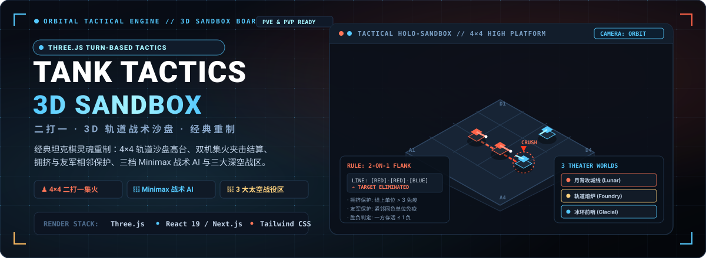

<p align="center">
  
</p>

<p align="center">
  <a href="https://holynova.github.io/tank-tactics-3d/"></a>
  <a href="https://tank-tactics-3d.holy-nova.chatgpt.site/"></a>
  <a href="https://threejs.org/"></a>
  <a href="https://react.dev/"></a>
  <a href="LICENSE"></a>
</p>

<p align="center">
  <strong>经典「二打一」坦克棋的太空轨道重制版 · 纯函数规则引擎与 3D 高台战术沙盘</strong><br>
  4×4 空间沙盘 · 侧翼二打一交叉集火 · 拥挤与友军相邻保护 · 3 档 Minimax 战术 AI · 零 CDN 外部依赖
</p>

---

## 🕹️ 在线试玩与体验

- **官方 GitHub Pages 站点**：[https://holynova.github.io/tank-tactics-3d/](https://holynova.github.io/tank-tactics-3d/)
- **备用镜像站点 (Cloudflare / ChatGPT Site)**：[https://tank-tactics-3d.holy-nova.chatgpt.site/](https://tank-tactics-3d.holy-nova.chatgpt.site/)
- **参考规则原案**：规则与玩法移植自经典的二打一策略棋局源项目 [holynova/tank-tactics-game](https://github.com/holynova/tank-tactics-game)，表现层全新重构为高台俯瞰的深空重炮阵地。

---

## ♟️ 核心战术规则与判定机制

游戏在紧凑的 `4×4` 高台沙盘展开，红方执攻防重炮居第 0 行，蓝方执离子重炮居第 3 行，每方各拥有 4 台战车：

```text
    Col 0    Col 1    Col 2    Col 3
Row 0 [ R ]    [ R ]    [ R ]    [ R ]   <-- 红方初始防线（初始朝下）
Row 1 [ . ]    [ . ]    [ . ]    [ . ]
Row 2 [ . ]    [ . ]    [ . ]    [ . ]
Row 3 [ B ]    [ B ]    [ B ]    [ B ]   <-- 蓝方初始防线（初始朝上）
```

### 1. 先手掷骰 (Initiative Phase)
开局双方各投掷一枚虚拟 1~6 点骰子，点数较大者获得先手机动权；若平局则自动重新掷骰直至决出先手。

### 2. 回合与移动 (Movement Phase)
* 轮到行动方选择己方一台存活战车，向**上、下、左、右四向正交相邻一格**机动；
* 目标格必须为空地，且不能斜向行进；
* 点选非法格子或取消选择不消耗机动步数与回合。

### 3. 集火侧翼结算 (Focus-Fire Flanking)
单位落定后，规则引擎**仅扫描本次落点所在的行与列**进行局部判定：
1. **拥挤保护 (Crowding Immunity)**：若该线上存活单位总数大于 3（即达到 4 台塞满），则整条线触发拥挤互锁，豁免本次全部集火检查；
2. **二打一三格连续判定**：依次扫描连续三格排列。当出现 `[攻击方]-[攻击方]-[防守方]` 或 `[防守方]-[攻击方]-[攻击方]` 时，**位于最外侧的防守方战车将被判定为暴露在双重火力夹击下**；
3. **友军相邻保护 (Friendly Adjacent Shield)**：若受威胁的防守方在其所在线上紧挨着同色友军，则获得伴随装甲协同掩护，免于被歼灭；
4. **多线与多目标结算**：行与列独立结算，一次战术机动可能同时触发十字双向交叉集火，结果自动去重并执行物理后坐开火与爆破动画。

### 4. 胜负终局 (Victory Condition)
任一方存活战车数 **≤ 1** 时，判定该方全线崩溃，对方立即胜出。

---

## 🌌 三大深空战役主题 (Theaters of War)

游戏内建同世界观下的 3 个特色鲜明的宏大空间战场，提供专属光影、底盘涂装与粒子气氛：

| 战役主题 | 阵营代号（红 vs 蓝） | 战场地貌与环境特效 | 战术色系 |
| :--- | :--- | :--- | :--- |
| **月背攻城线 (Lunar Siege Line)** | 熔核炮队 vs 寒光炮队 | 月球背面幽暗环形山，履带重炮沿月表深壕推进，陨石坑间漫游尘埃 | 熔岩橙 `#ff6348` / 寒冰蓝 `#55caff` |
| **轨道熔炉 (Orbital Foundry)** | 赤星炮队 vs 星港炮队 | 失压高轨道太空船坞与悬浮残骸，高对比度工业结构与能量喷流 | 赤星红 `#ff7658` / 星港青 `#58d4f0` |
| **冰环前哨 (Glacial Outpost)** | 余烬重炮 vs 霜环重炮 | 巨型碎冰行星带前哨基地，步行炮台在冰环碎屑中抢占射击死角 | 余烬红 `#ff765d` / 霜环冰 `#60d7ed` |

---

## 🤖 战术模式与 Minimax AI

* **本地双人同屏对弈 (Pass & Play)**：支持两人在同一台电脑或手机触屏上轮流下子，复刻经典桌游策略博弈；
* **三档智能 PvE (Minimax Engine)**：
  * 电脑执红方、玩家执蓝方；
  * **新兵 (Recruit)**：1 层搜索深度，适合快速上手规则；
  * **老兵 (Veteran)**：2 层搜索深度，兼顾防守站位与阵型保护；
  * **精英 (Elite)**：3 层深搜 + 拥挤保护预判，擅长故意布局诱敌深入后实施多向夹击；
  * 纯透明无作弊：AI 严格遵循与玩家完全一致的合法走子规则，不具备任何透视或数值加成。

---

## 🎮 交互操控与相机视角

* **3D 轨道相机视角**：
  * **单指拖拽 / 鼠标左键按住**：360° 环视旋转观察棋盘战局；
  * **双指捏合 / 鼠标滚轮**：平滑推进缩放视图；
  * **平移与复位**：右上角配备快捷 `+` 放大、`-` 缩小与 `⟲` 战术初始视角复位按钮；
* **电影感打击特效**：真实炮塔转向追踪、后坐力位移、实体弹道抛射、炮口弧光冲击环与金属破片飞溅；
* **移动端优先 HUD**：全面适配 iOS Safari 底部 Safe Area 与各种异形屏，提供低对比度触觉提示与屏幕朗读辅助支持。

---

## 📂 项目结构

```text
tank-tactics-3d/
├── assets/
│   └── readme/
│       └── hero.svg           # 项目原生纯矢量 1200x440 战术 HUD 题图
├── app/
│   ├── components/
│   │   ├── scene/             # Three.js 3D 渲染组件
│   │   │   ├── Board.tsx      # 4×4 战术沙盘高台模型与网格光效
│   │   │   ├── TankUnit.tsx   # 战车实体、独立旋转炮塔与开火后坐
│   │   │   └── Environment.tsx# 星空、环形山与战区雾效光照
│   │   └── TacticalGame.tsx   # 游戏主流程、状态控制器与移动端 HUD
│   └── game/                  # 纯函数规则与决策引擎
│       ├── ai.ts              # Minimax 决策算法与启发式评估函数
│       ├── rules.ts           # 4×4 走子、三格连续集火与保护判定核心
│       ├── themes.ts          # 月背 / 熔炉 / 冰环三大战区视觉定义
│       ├── audio.ts           # Web Audio 合成火炮轰鸣与机械步进音效
│       └── use-game-controller.ts # 游戏状态机与输入锁
├── public/                    # 本地独立托管轻量 GLB 模型（CC0 协议，无需外链 CDN）
├── PLAN.md                    # 项目设计蓝图与里程碑
├── RULES.md                   # 规则规格定义与边界用例
├── TASKS.md                   # 功能拆解与自动化测试覆盖清单
├── ASSET_LICENSES.md          # 视觉模型 CC0 1.0 许可声明
├── package.json               # 依赖项配置
└── vite.pages.config.ts       # GitHub Pages 专属打包管线
```

---

## 🛠️ 本地运行与自动化验证

环境需求：Node.js `>= 22.13.0`。

```bash
# 1. 安装项目依赖
npm install

# 2. 启动本地全功能开发服务器
npm run dev

# 3. 执行 Vitest 规则引擎 18 项自动化测试
npm test

# 4. 执行 TypeScript 严格类型检查
npx tsc --noEmit

# 5. 构建静态 GitHub Pages 生产包
npm run build:pages

# 6. 本地预览 GitHub Pages 产物
npm run preview:pages
```

---

## 📜 开源协议与致谢

- 游戏玩法规则基于 [holynova/tank-tactics-game](https://github.com/holynova/tank-tactics-game)（MIT License）。
- 履带主战坦克与自行火炮使用随站点打包的轻量本地 GLB 模型，详细来源遵循 CC0 1.0 协议，参见 [`ASSET_LICENSES.md`](ASSET_LICENSES.md)。
- 本项目整体遵循 [MIT License](LICENSE) 开源。
